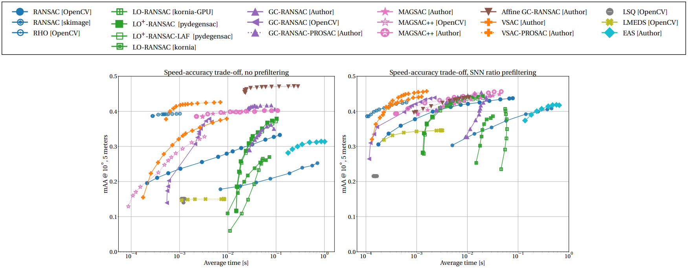

# Dataset

The dataset is available at [link](https://polybox.ethz.ch/index.php/s/R5sPelZ8688It92).

# Requirements

- Eigen 3.0 or higher
- OpenCV 3.0 or higher

# Running homography estimation with OpenCV

The tests runnin OpenCV can be started by calling
```
python test_opencv.py --path=<path to the database folder>
```

The following additional parameters are accepted:
```
--split = { train, test } - Select the split to be used. Default: train
--scene = { all, NYC_Library, Alamo, Yorkminster, Tower_of_London, Madrid_Metropolis, Ellis_Island, Roman_Forum, Vienna_Cathedral, Piazza_del_Popolo, Union_Square } - Select the scene. Default: all
--config_path - The path to the config file
--snn_threshold - SNN ratio threshold for SIFT correspondence filtering. Default: 0.80
--confidence - The RANSAC confidence. Default: 0.99
--inlier_threshold - The inlier-outlier threshold in pixels. Default: 15.0
--maximum_iterations - The maximum number of RANSAC iterations. Default: 1000
--core_number - The core number for the parallel processing
--opencv_flag = { RANSAC, LMEDS, RHO, USAC_MAGSAC } - The flag to select the robust estimator from OpenCV
```

# Benchmarking results

Results with traditional methods with and without SNN filtering.



Results with deep filtering.


# Acknowledgements

When using the dataset, please cite

```
@inproceedings{HEB2023,
	author = {Daniel Barath, Dymtro Mishkin, Michal Polic, Wolfgang Förstner, Jiri Matas},
	title = {A Large Scale Homography Benchmark},
	booktitle = {Conference on Computer Vision and Pattern Recognition},
	year = {2023},
}

```
